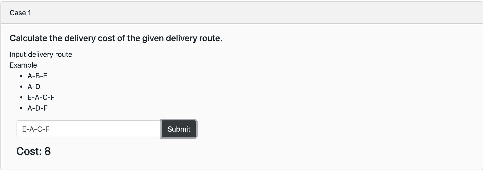
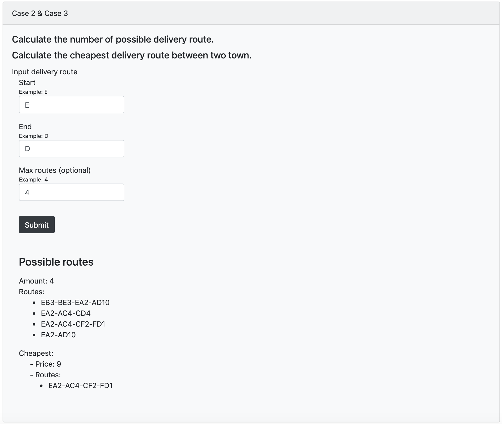

## Delivery Service

Delivery Service for Client\
Use with Delivery Calculate API only

### Demo

You can see and test on:
https://ek-delivery-client.herokuapp.com/

### Installation

Requires [Node.js](https://nodejs.org/) v10+ to run.

Install the dependencies and devDependencies and start the server.

```sh
$ npm install
or
$ yarn
```

### Run in Development Mode

```sh
$ npm run start
or
$ yarn start
```

### Document

##### Case 1

input Route and submit\
example\
route: E-A-C-F



##### Case 2 & Case 3

input\
Start Route\
End Route\
Max Routes (optional)\
and Submit

Example\
Start: E\
End: D\
Max Routes (optional): 4


